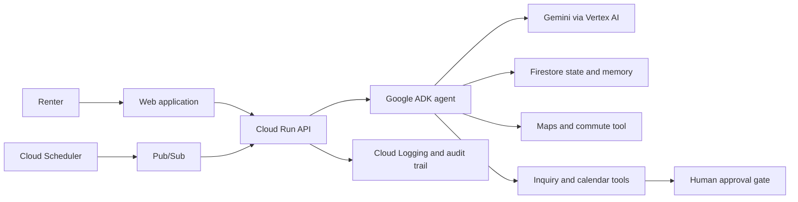

# Keys by Friday

An autonomous apartment-search agent that helps renters find the right home before the best listings disappear. It continuously evaluates listings against a renter's budget, commute, and lifestyle preferences; analyzes listing text, photos, floor plans, safety signals, and total costs; and surfaces the best evidence-backed options.

With renter approval, Keys by Friday can draft landlord outreach and coordinate property viewings.

Built for the [All Things Agentic Hackathon](https://allthingsagentichackathon.devpost.com/) in the **Taskmaster** track.

## Why Keys by Friday?

Apartment hunting is repetitive, fragmented, and time-sensitive. Renters must search multiple sources, compare inconsistent details, uncover fees and deposits, estimate commute times, inspect photos and floor plans, and move quickly on promising homes. A great listing can be gone before those steps are complete.

Keys by Friday is a renter-controlled search operator that turns that work into a transparent decision flow:

- Learns hard constraints and lifestyle preferences from renter feedback.
- Evaluates newly available or user-provided listings continuously.
- Extracts structured listing details and supporting evidence from text, images, floor plans, and documents.
- Calculates total monthly cost, commute trade-offs, and preference fit.
- Rejects listings that fail non-negotiable requirements, then ranks the rest transparently.
- Builds a searchable history of decisions, feedback, and agent actions.
- Keeps all landlord outreach and calendar actions behind explicit renter approval.

## MVP

Our first end-to-end vertical slice will:

1. Collect a renter's budget, target areas, move-in date, commute destination, and must-have constraints.
2. Accept a sample apartment listing with text and an image or floor plan.
3. Use Gemini to extract a validated, normalized listing record with evidence for each field.
4. Apply deterministic hard constraints before calculating a preference score.
5. Persist the evaluation and execution trace in Firestore.
6. Show the recommendation, evidence, trade-offs, and missing information in a renter dashboard.
7. Run the application on Google Cloud Run.

Automated scraping, landlord messaging, calendar booking, payments, and lease signing are intentionally out of scope for this initial milestone.

## Architecture



## Planned technology

- **Agent:** Python and Google Agent Development Kit (ADK)
- **AI:** Gemini through Vertex AI
- **API:** FastAPI on Cloud Run
- **Web:** TypeScript and Next.js
- **State and memory:** Firestore
- **Background work:** Cloud Scheduler and Pub/Sub
- **Location intelligence:** Google Maps Routes API
- **Approved actions:** Gmail and Google Calendar APIs
- **Operations:** Cloud Logging, IAM, Secret Manager, and budget alerts

## Repository layout

```text
keys-by-friday/
├── agent/             # ADK agent, tools, prompts, and evaluations
├── web/               # Renter dashboard and approval interface
├── infra/             # Google Cloud deployment configuration
├── data/              # Synthetic and permitted test listings
├── tests/             # Unit, integration, and evaluation suites
├── docs/              # Architecture decisions, diagrams, and demo assets
├── .env.example       # Variable names only; never real credentials
├── LICENSE
├── NOTICE
└── README.md
```

## Development principles

- **Renter control:** External communications and calendar changes always require explicit approval.
- **Evidence first:** Recommendations must cite the listing material that supports them.
- **Deterministic guardrails:** Hard constraints cannot be overridden by model prose.
- **Privacy by design:** Use synthetic demo data where possible; store secrets in Secret Manager and redact sensitive values from logs.
- **Respectful data use:** Ingest listings only through permitted APIs, datasets, emails, uploads, or renter-provided URLs.

## Roadmap

- [ ] **M0 — Foundation:** repository, architecture decision record, GCP project, and secret handling
- [ ] **M1 — Vertical slice:** preferences → listing extraction → constraint check → Firestore → dashboard
- [ ] **M2 — Decision quality:** multiple listings, total-cost normalization, commute calculation, and evidence-backed ranking
- [ ] **M3 — Agent loop:** scheduled ingestion, persistent memory, retries, and execution timeline
- [ ] **M4 — Approved actions:** inquiry drafting, renter approval, landlord contact, and viewing coordination
- [ ] **M5 — Submission:** evaluations, deployment proof, reproducible setup, and a four-minute demo

## Contributing

1. Create or claim a GitHub issue before beginning a work item.
2. Branch from `main` using names such as `feature/listing-extraction` or `fix/idempotent-evaluation`.
3. Keep pull requests focused and link them to their issue.
4. Never commit `.env` files, API keys, OAuth tokens, or service-account credentials.

Suggested commit prefixes: `feat:`, `fix:`, `docs:`, `test:`, `refactor:`, `build:`, and `chore:`.

## License

This project is licensed under the [Apache License 2.0](LICENSE). See [NOTICE](NOTICE) for attribution.
