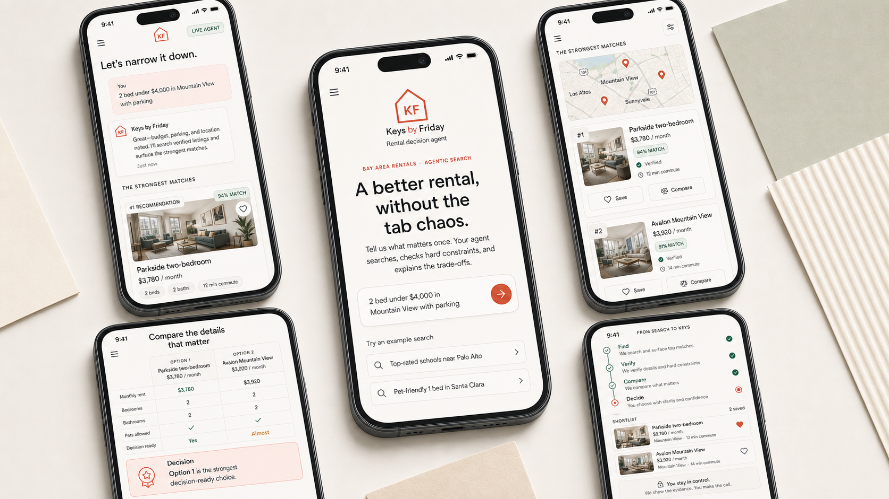

<p align="center">
  
</p>

<h1 align="center">Keys by Friday</h1>

<p align="center">
  <a href="https://github.com/Taoyuan-AI-Lab/keys-by-friday/actions/workflows/ci.yml">
    
  </a>
  <a href="https://www.python.org/">
    
  </a>
  <a href="https://nextjs.org/">
    
  </a>
  <a href="https://fastapi.tiangolo.com/">
    
  </a>
  <a href="https://google.github.io/adk-docs/">
    
  </a>
  <a href="LICENSE">
    
  </a>
</p>

<p align="center">
  
</p>

AI rental search that helps you move from scattered listings to a confident decision. Keys by Friday searches with your priorities, verifies the details that matter, and explains the trade-offs before you shortlist a home.

Built with **Next.js + FastAPI + Google ADK**.

Production uses Firestore for product data and an official persistent ADK
database session service for restart-safe conversational state. See the
[Firestore](docs/firestore.md), [persistent ADK sessions](docs/adk-sessions.md),
and [comparison and shortlist](docs/comparison-shortlist.md) guides. Public
deployment cost protection is explained in [rate limits](docs/rate-limits.md).

## Quick Start

### 1. Install the prerequisites

You need:

- [Git](https://git-scm.com/)
- [uv](https://docs.astral.sh/uv/)
- [Node.js](https://nodejs.org/) 24 recommended

On Windows, install `uv` with:

```powershell
winget install --id=astral-sh.uv -e
```

### 2. Initialize the project once

From the repository root:

```powershell
.\kbf init
```

The setup does the rest for you:

- installs Python and FastAPI dependencies
- installs frontend npm dependencies
- shows where to create the Gemini and RealtyAPI keys
- asks for the keys securely
- creates the local `.env` files
- installs the normal `kbf` command

API keys:

- Gemini: https://aistudio.google.com/app/apikey
- RealtyAPI: https://www.realtyapi.io/

### 3. Start the app

Use either form:

```powershell
kbf start
```

or:

```powershell
.\kbf start
```

Then open [http://localhost:3000](http://localhost:3000).

Useful local URLs:

| Service | URL |
|---|---|
| Product UI | [localhost:3000](http://localhost:3000) |
| API docs | [localhost:8000/docs](http://localhost:8000/docs) |
| Backend health | [localhost:8000/health](http://localhost:8000/health) |
| Backend readiness | [localhost:8000/ready](http://localhost:8000/ready) |
| ADK Web | [localhost:8765](http://localhost:8765) |

Press `Ctrl+C` once to stop the frontend and backend.

## CLI Commands

After the first `init`, both the installed command and repository-local launcher are supported:

| Task | Installed command | Repo-local command |
|---|---|---|
| Initialize / refresh setup | `kbf init` | `.\kbf init` |
| Start the full product | `kbf start` | `.\kbf start` |
| Start ADK Web only | `kbf agent` | `.\kbf agent` |

For a completely fresh clone, use `.\kbf init` first. That command installs the normal `kbf` command for later use.

If `kbf` is not found in the current terminal after initialization, open a new terminal or use the `.\kbf ...` form.

## Agent-only Development

To work directly with the Google ADK developer UI without starting the product frontend:

```powershell
kbf agent
```

or:

```powershell
.\kbf agent
```

Then open [http://localhost:8765](http://localhost:8765).

This wraps:

```powershell
uv run adk web . --no-reload --port 8765
```

ADK Web is for Agent development and debugging. The normal product does **not** depend on port 8765.

## Custom Ports

If port `3000` or `8000` is already being used:

```powershell
kbf start --frontend-port 3001 --backend-port 8021
```

The repository-local form works too:

```powershell
.\kbf start --frontend-port 3001 --backend-port 8021
```

## How Keys by Friday Connects

```text
Browser
  ↓
Next.js Frontend :3000
  ↓  POST /api/chat
FastAPI Backend :8000
  ↓
AgentService
  ├→ Google ADK Rental Agent → Rental Provider
  └→ ADK SessionService → memory locally / PostgreSQL in production
```

The frontend talks only to the FastAPI API. The backend owns the ADK adapter. Rental search, ranking, verification, and provider logic stay in `rental_agent/**`.

## Project Ownership

```text
frontend/**      → Frontend
backend/**       → HTTP API and Agent adapter
rental_agent/**  → ADK Agent and rental decision logic
docs/**          → Shared project references
```

The shared web contract is:

```text
GET    /health
GET    /ready
POST   /api/chat
POST   /api/route
POST   /api/compare
GET    /api/conversations
GET    /api/shortlist
POST   /api/shortlist
PATCH  /api/shortlist/{listingId}
DELETE /api/shortlist/{listingId}
```

Feature work should extend this baseline instead of creating a parallel architecture.

## Before Opening a PR

Run the same baseline checks used by CI:

```powershell
uv run pytest backend/tests tests -q
uv run python -m compileall backend rental_agent -q

cd frontend
npm run check
```

GitHub Actions runs the Python and Frontend checks on pushes and pull requests.

## Documentation

| Document | Purpose |
|---|---|
| `README.md` | Start here: setup, commands, and project overview |
| `docs/architecture.md` | Stable system boundaries |
| `docs/api-contract.md` | Stable Frontend ↔ Backend contract |
| `docs/development.md` | Manual service commands and contributor workflow |
| `docs/deployment.md` | macOS, Docker, and Cloud Run backend deployment |
| `docs/authentication.md` | Firebase identity setup and Milestone 2 tests |
| `docs/maps.md` | Google Routes / commute setup and testing |
| `docs/firestore.md` | Firestore repositories, shortlist persistence, and Milestone 3 tests |
| `docs/adk-sessions.md` | Persistent ADK sessions, restart test, concurrency, and Milestone 4 setup |
| `docs/comparison-shortlist.md` | Canonical listings, comparison, shortlist CRUD, and Milestone 5 tests |
| `docs/rate-limits.md` | Anonymous Firebase rate limiting, Firestore counters, and cost boundaries |
| `docs/agent.md` | Stable Agent authority and behavior rules |
| `docs/status.md` | **Living:** current implementation status |
| `docs/roadmap.md` | **Living:** priorities and next work |

Stable documents change only when the actual setup, architecture, API contract, ownership, or Agent authority changes. Normal progress belongs in `docs/status.md` and `docs/roadmap.md`.
