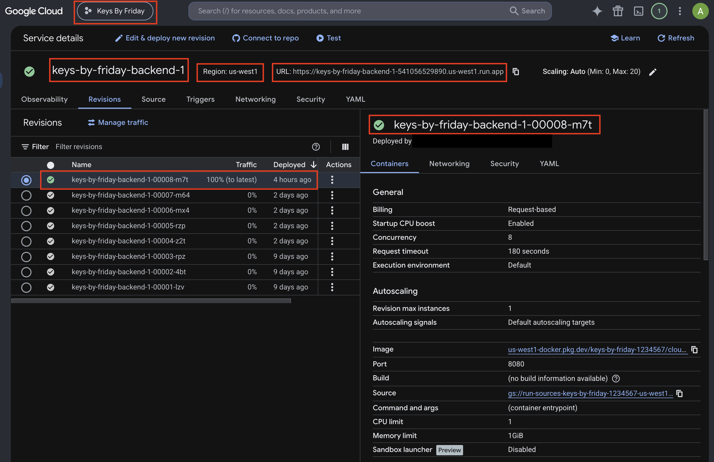
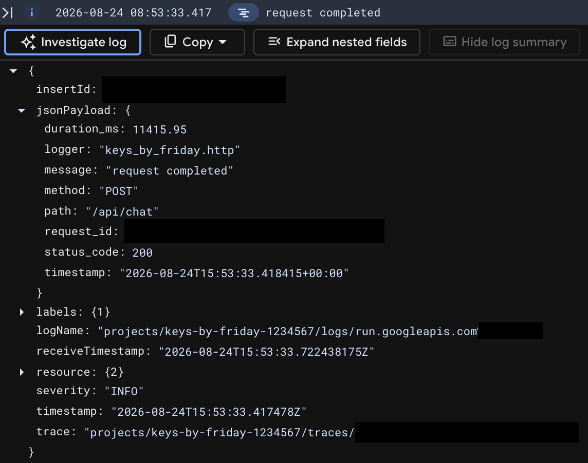
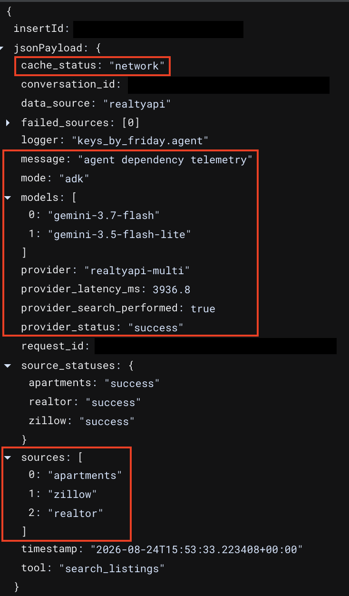
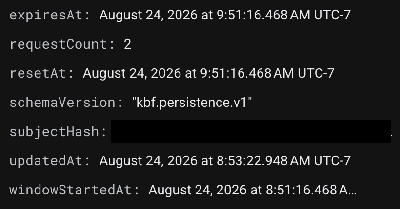
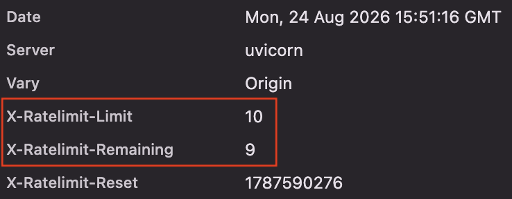
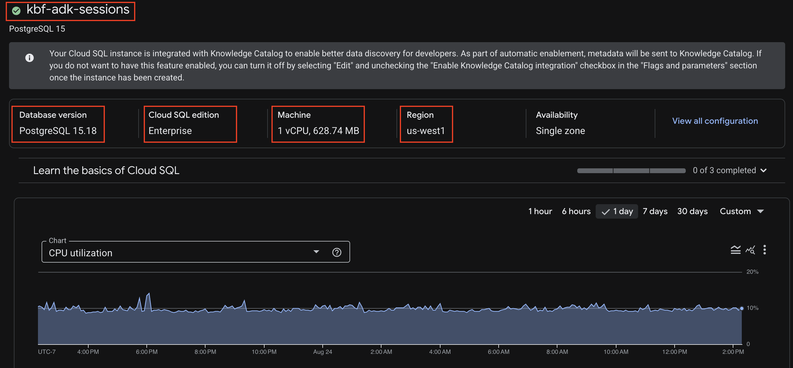
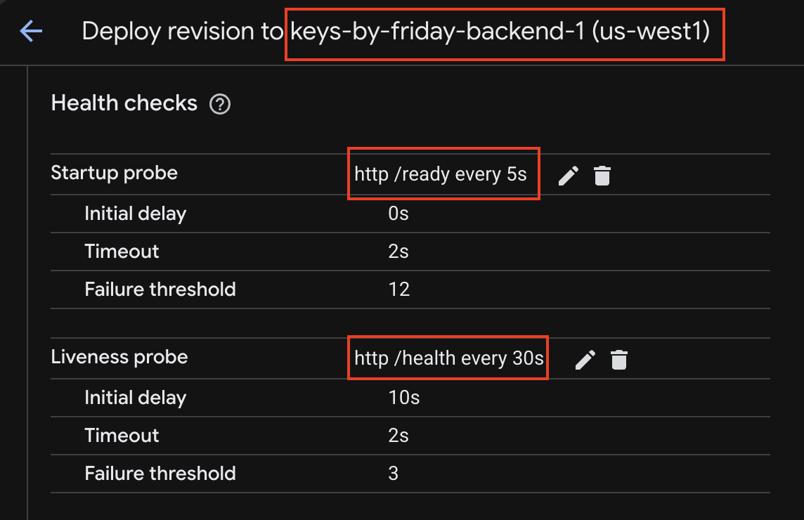
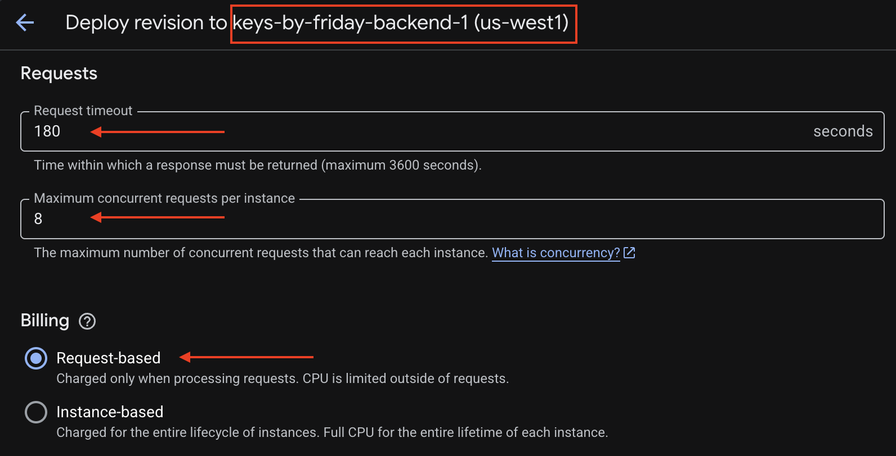
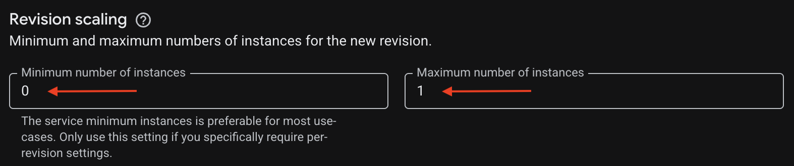

# Private Backend MVP Deployment Proof

> Evidence captured on August 24, 2026.
> This document contains no API keys, authentication tokens, database passwords,
> Secret Manager values, or private environment files.

## Deployment Decision

The Keys by Friday backend was deployed as a private hackathon MVP.

The Cloud Run service intentionally requires Google Cloud authentication. The
local product UI can be used for the user-facing demonstration, while an
authenticated command-line request and Cloud Run logs prove that the production
backend was deployed and executed on Google Cloud.

This is a private production-deployed MVP, not a publicly accessible backend.

Full sanitized evidence archive: [Google Drive deployment proof folder](https://drive.google.com/drive/folders/1_lM_2-QUrrtBfsb5GZtbY11ken_NKY6f?usp=sharing)

## Release Reference

- Repository branch: `main`
- Repository commit at evidence capture:
  `ff0d1a355dd24046b86f4a8734f967189c4a9244`
- Short commit: `ff0d1a3`
- Commit description:
  `chore: upgrade Gemini routine fallback to 3.7 Flash (#31)`
- Cloud Run service: `keys-by-friday-backend-1`
- Active Cloud Run revision: `keys-by-friday-backend-1-00008-m7t`
- Revision creation time: August 24, 2026
- Region: `us-west1`
- Traffic: 100% to the active revision

Cloud Run recorded the source deployment archive and container-image digest,
but the revision metadata does not contain a Git commit SHA. The repository
commit and Cloud Run revision are therefore listed separately rather than
claiming a cryptographically verified commit-to-revision relationship.



## Private Access and Readiness

An unauthenticated request to `/health` returned:

```text
HTTP 403 Forbidden
```

An authenticated request to `/health` returned:
```json
{
  "status": "ok"
}
```

An authenticated request to `/ready` returned HTTP 200:
```json
{
  "status": "ready",
  "checks": {
    "api": "ok",
    "auth": "configured",
    "persistence": "configured",
    "anonymous_rate_limit": "firestore",
    "adk_session": "connected",
    "agent": "configured",
    "provider": "configured"
  }
}
```

This verifies that FastAPI was running and that the production authentication, persistence, rate-limit, ADK session, Agent, and listing-provider configuration was ready.

## Live Agent and Listing-Provider Result
A live authenticated `POST /api/chat` request completed on the deployed Cloud Run revision with HTTP 200.

The Agent dependency telemetry reported:
- Agent mode: `adk`
- Primary model: `gemini-3.7-flash`
- Listing provider: `realtyapi-multi`
- Provider search performed: `true`
- Provider status: `success`
- Failed sources: none
- Apartments.com source: success
- Zillow source: success
- Realtor source: success





## Firebase Authentication
The backend was configured with Firebase Admin token verification.

Evidence:
- `/ready` reported auth: `configured`.
- Requests with missing or invalid Firebase authentication were rejected.
- The valid authenticated live `/api/chat` request completed with HTTP 200.
- Authenticated user IDs are used for conversation ownership and persistence.

No Firebase ID token is included in this repository.

## Firestore Persistence and Rate Limiting
The backend uses Firestore repositories for conversation metadata, shortlist
snapshots, and distributed anonymous rate limiting.

A Firestore rate-limit record contained:
- Schema version: `kbf.persistence.v1`
- Request counter
- Rate-limit expiration time
- Reset time
- Updated timestamp
- Hashed subject identifier

The unhashed user identifier was not stored in the evidence.



The corresponding backend response included the anonymous rate-limit headers:
- `X-RateLimit-Limit`
- `X-RateLimit-Remaining`
- `X-RateLimit-Reset`



## Persistent ADK Sessions

Google ADK session history is stored in a Cloud SQL PostgreSQL database.
- Instance: `kbf-adk-sessions`
- Database engine: PostgreSQL 15
- Region: `us-west1`
- State during verification: `RUNNABLE`
- Backend readiness result: adk_session: `connected`



The Cloud SQL instance proves that the database exists and is running. The `/ready` result proves that the backend can connect to the database.

## Cloud Run Health Checks

The active backend configuration uses:
- Startup probe: HTTP `/ready` every 5 seconds
- Startup timeout: 2 seconds
- Startup failure threshold: 12
- Liveness probe: HTTP `/health` every 30 seconds
- Liveness initial delay: 10 seconds
- Liveness timeout: 2 seconds
- Liveness failure threshold: 3



## Runtime and Cost Controls

The active Cloud Run revision uses:
- Request-based billing
- Request timeout: 180 seconds
- Concurrency: 8 requests per instance
- Revision minimum instances: 0
- Active revision maximum instances: 1
- CPU: 1 vCPU
- Memory: 1 GiB

The minimum of zero allows Cloud Run to scale down when idle. The active revision cap of one prevents unexpected multi-instance scaling during the hackathon.




## Google Cloud Services Used

The following required APIs were enabled:
- Agent Platform / Vertex AI — `aiplatform.googleapis.com`
- Cloud Firestore — `firestore.googleapis.com`
- Google Routes — `routes.googleapis.com`
- Cloud Run — `run.googleapis.com`
- Secret Manager — `secretmanager.googleapis.com`
- Cloud SQL Admin — `sqladmin.googleapis.com`

Additional deployment infrastructure includes Cloud Build and Artifact Registry. Enabling the Routes API proves configuration availability. A separate live Routes smoke test is still required before claiming that the production commute path has been verified end to end.

## Automated Verification

Evidence captured from the current repository:
- Python backend, Agent, and integration suite: 221 passed
- Frontend suite: 10 test files and 78 tests passed
- Python compilation check: passed
- TypeScript typecheck: passed
- Next.js production build: passed
- Repository branch matched origin/main at evidence capture

The test suite uses local fakes and mocks where appropriate. The live Cloud Run evidence above separately verifies the deployed Agent and listing-provider path.

## Cost and Shutdown Plan

Cloud Run is configured with zero minimum instances and request-based billing, allowing it to scale down when unused. Cloud SQL remains a billable resource while its activation policy is ALWAYS.

After the demo recording and team testing are finished, it can be stopped:
```bash
gcloud sql instances patch kbf-adk-sessions \
  --project=keys-by-friday-1234567 \
  --activation-policy=NEVER
```

It can be restarted before another demonstration:
```bash
gcloud sql instances patch kbf-adk-sessions \
  --project=keys-by-friday-1234567 \
  --activation-policy=ALWAYS
```

When Cloud SQL is stopped, `/ready` and chat requests that require persistent ADK sessions are expected to fail until it is restarted.

Budget alerts were configured separately in Google Cloud Billing. Budget alerts notify the team but do not guarantee that spending automatically stops.

## Known MVP Boundaries

- The Cloud Run backend is intentionally private.
- A normal browser cannot call the service directly without Cloud Run authentication.
- The user-facing UI can be demonstrated locally.
- Cloud SQL automated backups, deletion protection, high availability, and point-in-time recovery are not enabled for the short-lived hackathon MVP.
- The active revision is capped at one instance. Multi-instance distributed conversation locking requires additional production design.
- The live Agent and RealtyAPI search path was verified.
- A live Google Routes smoke test is still outstanding.

## Security and Redaction

This evidence intentionally excludes:
- `.env` files
- API keys
- Firebase ID tokens
- Cloud Run identity tokens
- Database usernames and passwords
- ADK database connection URLs
- Secret Manager secret values
- Raw user IDs
- Full request and conversation identifiers

Only service names, regions, non-secret configuration, sanitized logs, and
deployment results are shown.
